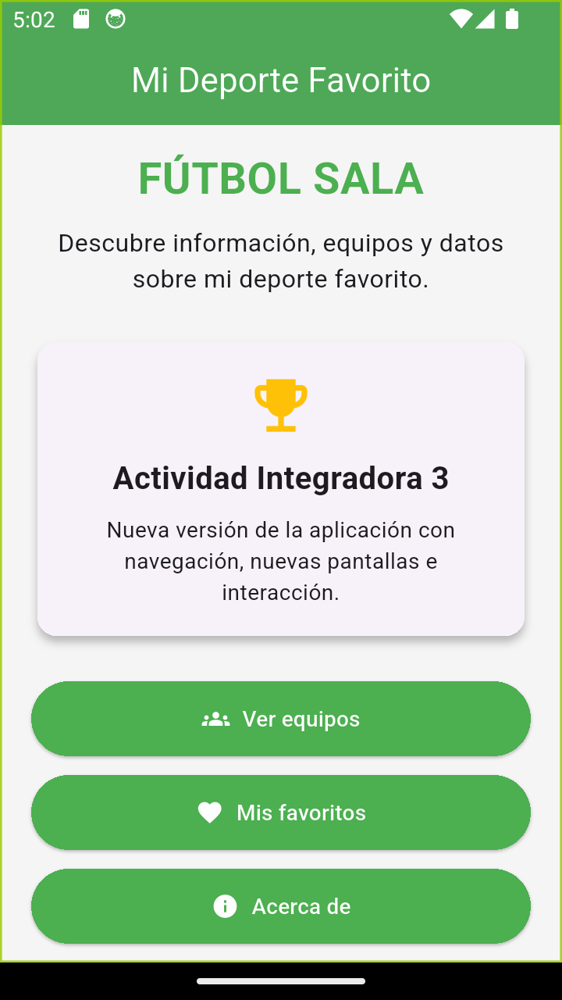
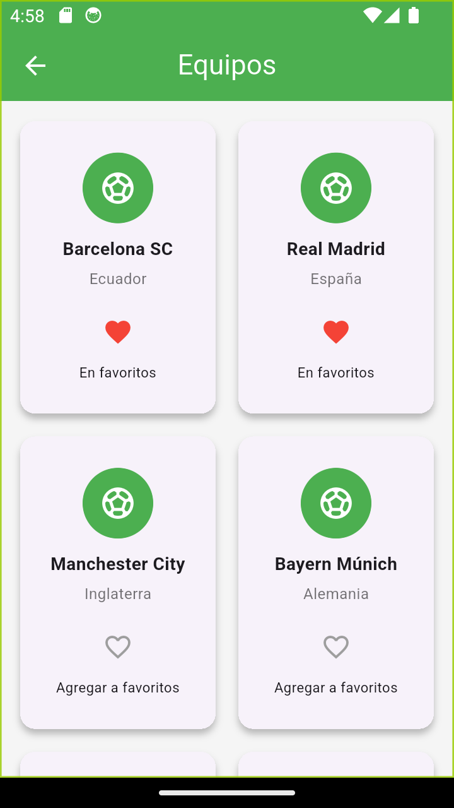
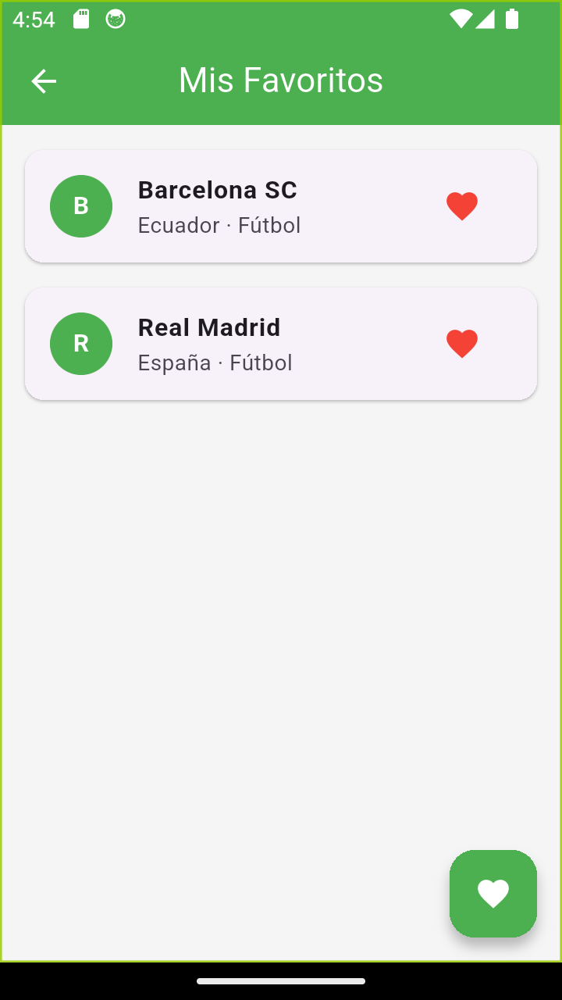
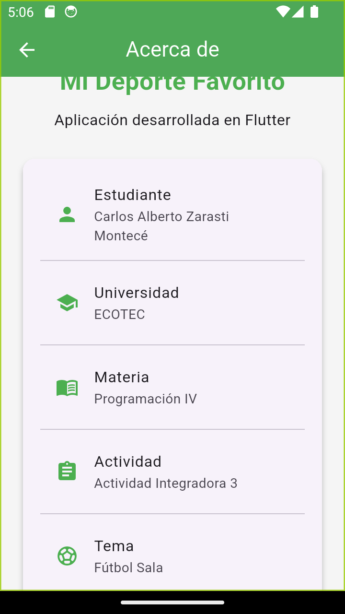

# Mi Deporte Favorito

## Descripción

Mi Deporte Favorito es una aplicación móvil desarrollada con Flutter sobre la temática del fútbol sala. La aplicación permite navegar entre diferentes pantallas, visualizar equipos y administrar una lista de equipos favoritos mediante Provider.

Este proyecto corresponde a la Actividad Integradora 3 de Programación IV.

## Objetivo

Desarrollar una aplicación Flutter organizada en diferentes archivos y carpetas, aplicando navegación entre pantallas, widgets reutilizables, un modelo de datos y gestión de estado mediante Provider.

## Funciones principales

- Pantalla principal de la aplicación.
- Navegación entre cuatro pantallas.
- Visualización de equipos mediante GridView.
- Selección y eliminación de equipos favoritos.
- Actualización automática de favoritos entre distintas pantallas.
- Uso de Provider para administrar el estado.
- Uso de widgets personalizados reutilizables.
- Pantalla informativa Acerca de.

## Tecnologías utilizadas

- Flutter
- Dart
- Provider
- Material Design

## Estructura del proyecto

```text
lib/
├── models/
│   └── sport.dart
├── providers/
│   └── sport_provider.dart
├── screens/
│   ├── about_screen.dart
│   ├── favorites_screen.dart
│   ├── home_screen.dart
│   └── teams_screen.dart
├── widgets/
│   ├── favorite_button.dart
│   └── sport_card.dart
└── main.dart
```

## Uso de Provider

La aplicación utiliza Provider para administrar los equipos favoritos.

La clase `SportProvider` extiende de `ChangeNotifier` y mantiene la lista de equipos seleccionados como favoritos. Cuando el usuario agrega o elimina un equipo se ejecuta `notifyListeners()`, permitiendo que las pantallas que utilizan `Consumer<SportProvider>` se actualicen automáticamente.

`ChangeNotifierProvider` se configura desde `main.dart` para que el estado esté disponible en las diferentes pantallas de la aplicación.

De esta manera, un equipo seleccionado como favorito en la pantalla Equipos aparece automáticamente en la pantalla Mis Favoritos.

## Widgets reutilizables

Se desarrollaron dos widgets personalizados en archivos independientes:

### SportCard

Widget encargado de mostrar la información de cada equipo dentro de la cuadrícula de equipos.

### FavoriteButton

Widget reutilizable encargado de mostrar y controlar el botón de favorito mediante los íconos de corazón.

## Navegación

La aplicación utiliza `Navigator.push()` y `MaterialPageRoute` para navegar desde la pantalla principal hacia las demás pantallas.

Las cuatro pantallas principales son:

- Inicio
- Equipos
- Mis Favoritos
- Acerca de

## Ejecución del proyecto

Para ejecutar la aplicación:

```bash
flutter pub get
flutter run
```

Es necesario disponer de Flutter instalado y tener conectado un dispositivo Android o un emulador.

## Capturas de pantalla

### Pantalla de inicio



### Pantalla de equipos



### Mis favoritos - Evidencia de Provider



En esta evidencia se observa que los equipos seleccionados previamente permanecen en la lista de favoritos gracias al manejo de estado realizado con Provider.

### Pantalla Acerca de



## Control de versiones

El proyecto utiliza Git y GitHub como sistema de control de versiones. Se realizaron commits progresivos y descriptivos durante el desarrollo, incluyendo la implementación del modelo, Provider, widgets reutilizables, gestión de favoritos, documentación y evidencias.

## Autor

Carlos Alberto Zarasti Montecé

Actividad Integradora 3  
Programación IV  
Universidad ECOTEC